# MOCA-Vision

<p align="center">
  
</p>

# About

This is a Mono Repository for MOCA-Vision. A web-based smart surveillance platform with computer vision integrated in edge device.

Also used for source code in the research with title `"Website-based Smart Surveillance Platform with Computer Vision Integration in Edge Device to Enhance Physical Violence Monitoring in Campus Environment"`

If you have any question, feel free to contact me at my email: **afifsdi@gmail.com**

# Table of Contents

- [MOCA-Vision](#moca-vision)
- [About](#about)
- [Table of Contents](#table-of-contents)
- [Repository Structure](#repository-structure)
  - [Explanation](#explanation)
  - [Early Setup](#early-setup)
- [Backend](#backend)
- [LiveKit on Docker](#livekit-on-docker)
- [Frontend](#frontend)
- [Python Code](#python-code)
  - [Streamer App](#streamer-app)
  - [CV Server](#cv-server)
- [Computer Vision Research](#computer-vision-research)
- [Website Preview](#website-preview)
- [Credit and Acknowledgement](#credit-and-acknowledgement)

# Repository Structure

## Explanation

This repository contain all code used for building the `MOCA-Vision` website including it's edge device integration.

The illustration below shown the directory structure of this repository including folder and file in `.gitignore` which you need to configure it manually. 

You can check the `README` on each directory for more detailed explanation.

```
./
│
├──conf/
│    └──redis.conf
├──docker/
│    └──volumes/
├──file-storage/
├──livekit-conf/
│    ├──*.custom.yaml
│    ├──livekit.yaml
│    └──nginx.example.conf
├──python-code/
│    ├──computer-vision/
│    └──edge/
├──web-backend/
├──web-frontend/
├──.env.development
├──.env.example
├──.env.production
├──docker-compose-db.yml
└──ecosystem.config.cjs
```

Let's check each one of them

**1. `conf/redis.conf`**

This is a Redis configuration file used for Redis on docker. We especially need the config `protected-mode yes` to enable user authentication for Redis connection.

**2. `docker/volumes/`**

We are using PostgreSQL on docker for our database, this folder is where the database save all of it's data. Deleting this folder will cause a data removal in your database or even an error.

**3. `file-storage/`**

On some scenario you want to save your File Storage Folder outside the backend path, here's the example where you save it in it's parent folder.

This folder will be automatically generated when you start the backend server for the first time and this path hasn't exist yet.

At default, there will be 3 sub-folder inside your file storage.

- `profile-pictures`
  Contain all user's uploaded profile pictures

- `sample-video`
  Contain all uploaded sample video that could be used as camera source for edge device. The `GET Sample Video` API will do a directory listing inside of this folder.

- `violence-detection`
  Contain all violence detection recording video. The videos inside this folder will be removed periodically by the setting of your system's video retention (default is 7 days)

**4. `livekit-conf/`**

All file inside this folder are used for LiveKit Server on Docker configuration. By default there would be only two files inside this folder, `livekit.yaml` and `nginx.example.conf`. You could create your own LiveKit YAML file by giving it name with `.custom.yaml` prefix, that way the file could contain your classified information without being pushed to GitHub since.

> But why? Isn't there already an environment configuration for LiveKit in the Docker Compose file?

Well yeah, there is a reason for it. You see, I initially thought that some environment configuration and let the other as default would be enough to setting up the LiveKit Server.

But apparently not. WebRTC could work differently in different browser, especially if you compare it between chromium and non-chromium browser (ex. FireFox). LiveKit by default using a lite ICE server for it's connection, but browser like FireFox apparently has trouble on establishing connection with that, causing frontend can't show the stream and not receiving data from LiveKit data channel.

> Then we can just not using lite ICE server right?

Yeah, but it still somehow didn't work. It frustate me so much I decided to change the connection from WS to WSS, that's why there is a `LIVEKIT_LETSENCRYPT_FOLDER` in the docker compose setting.

There are a lot configuration to be done during development, that's why instead of putting each LiveKit's possible env configuration or putting env file name on the service I decide to make a customizable YAML file.

`nginx.example.conf` is an nginx available-site configuration which you can copy to setting up your HTTPS and WSS connection by forwarding the request to LiveKit port in 7880.

**5. `python-code/computer-vision/`**

This folder contain all IPYNB Notebook used to build the violence dataset and ST-GCN-TCN Model.

You can use the `UV` configuration there to install the dependencies but **only for preprocessing dataset notebook**. I use `Google Colab` to run the model builder notebook, that's why you could see the path configuration in model builder notebook is basically a Colab path.

`dataset_preprocessing.ipynb` is a notebook used to read all video files in `_dataset/` and produce `.npy` files as dataset. You can find the zipped dataset in [here](https://its.id/m/MOCA-Vision-Public) by the name `dataset.zip`

`ta_gnn_model_base_builder.ipynb` is a notebook to build the ST-GCN-TCN model for violence classification job. Why GNN? just to shorten the name. The notebook contain the same content with `ta_gnn_model_hpt_builder.ipynb` with the differences are in 9th cell which it use `base_params` as the best params and of course in the cell outputs as well.

`ta_gnn_model_hpt_builder.ipynb` is a notebook with the same purpose as `ta_gnn_model_base_builder.ipynb`. By the way, `hpt` stands for HyperParameter Tuning. You can see the tuning result for trial 80-99 there as well.

**6. `python-code/edge/`**

This folder contain both program used for running the Video Streamer App and the Computer Vision Server. You can see that there is no python file immediately once you open the `edge` folder, that is because all code are saved in the `edge-code` but the venv configuration (`.python-version` file and `requirements txt` file) is in the `edge` folder.

Video Streamer App running in `Python 3.9.25`, while

Computer Vision Server running in `Python 2.7.16` but you can use other version if you're not using Google Coral edge device (Recommended to not change your system's python version for running the CV Server)

**7. `web-backend/`**

This folder contains the MOCA-Vision backend built using ElysiaJS Framework and Bun as the runtime.

Backend contain the main server to run, well, the main server and whatsapp client worker that run as separate service from the main server. This is because Whatsapp JS library use Puppeteer to run and it can't run properly with Bun.

The Email worker run using nodemailer inside the main server.

Both Email and Whatsapp worker are using Bullmq Queue and Redis to queue their respective task.

**8. `web-frontend/`**

All code used for running MOCA-Vision frontend built using React Router Framework + Vite and Bun as the runtime.

Frontend share the same env file with backend in their parent folder which is this path.

> Is this the best practice?

Absolutely not. It is much more recommended to separate the frontend and backend env file for security reason, but during this research this practice helps to simplify the env management and reducing human error (since personally I'm too easy to forgetting something).

**9. `.env.development`**

This is the env file to configure MOCA-Vision docker service and run the website in development mode. You can copy values from `.env.example` and insert the other empty field with your own secret (ex. you need to insert your own google email and key to configure your email worker)

**10. `.env.example`**

This is the example env file you can use as reference.

**11. `.env.production`**

This is the env file to use in the production environment. Make sure to keep the content of this file as secure as possible

**12. `docker-compose-db.yml`**

This is the Docker Compose File contains all service used for backend.

- PostgreSQL (mocavis-be-database)

  The main database used to save all data, including user, system setting, violence recording, etc

- Redis (mocavis-be-redis)

  Cache used to save worker queues. It originally used to caching the violence record as well, but since the file result is always corrupt I never using redis for it anymore.

- LiveKit (mocavis-rtsp)

  LiveKit Server also being configured inside this docker compose file. You can always use the linux version if you're more convenient with it, this docker version used to ensure the reproducability of this system.

**13. `ecosystem.config.cjs`**

We're using `pm2` to manage all service running in the background. This file handle the Backend, Frontend, and Whatsapp worker service.

If you're using `pm2` with this file configuration, make sure to run it from this path since the path inside this file is not a static path which more prefarable to run `pm2`.

## Early Setup

Before running the MOCA-Vision system, you need to prepare some of the environment and hardware.

1. Development & Production Environment

I'm Using `Windows 11` for most of the development and `Ubuntu 24` for production. For the programming language, I'm using `Typescript 5.9.3` and `Bun 1.2.18` for runtime.

2. Edge device

I'm using `Google Coral Dev Board Mini` for the edge device to run the model inference. But you can also used your own device (laptop / pc) or cloud to run it, I already test it to run at the same cloud as the backend & frontend and it work well. Just make sure that if you want to run the model on GPU, find the proper library for tflite_runtime GPU, otherwise it will use your CPU as default.

Another note if you're using Google Coral Dev Board Mini, you might want to add an SD Card and set your uv cache and the code there to ensure you didn't running out of storage since Coral Dev Baord Mini only has 8 GB storage.

3. Environment Variables

Copy the `.env.example` file to `.env.development` or `.env.production`

```shell
cp .env.example .env.development
```

Here's the explanation of each variable in the `env` file:

| Variable | Value | Is Required | Explanation |
| --- | --- | --- | --- |
| `ENV` | `"development"` or `"production"` | yes | Environment mode |
| `SERVER_HOST` | `"moca-vision.com"` | no | If you have a domain, you can use this variable to save your domain name. |
| `ADMIN_EMAIL` | `"admin-moca@moca-vision.com"` | yes | Main email for initial admin, used to login etc. |
| `ADMIN_NAME` | `"Admin Moca"` | yes | Initial admin name. |
| `ADMIN_PASSWORD` | `"12345678"` | yes | Initial admin password. |
| `ADMIN_WA_RECEIVER` | `"6219212091029"` | yes | Whatsapp number for initial receiver, seeder will read this value to fill the whatsapp receiver for the first time. |
| `ADMIN_WA_CHANNEL` | `"dm"` or `"group"` | yes | Channel type of the initial receiver. If it was group, use the group id, else use the phone number with country code as the first number. |
| `ADMIN_EMAIL_RECEIVER` | `"dummy-email@gmail.com"` | yes | Initial email receiver, check spam if you didn't see the email. |
| `USE_GLOBAL_VIOLENCE_THRESHOLD` | `"false"` or `"true"` | yes | Boolean flag to switch between using global confidence threshold or not. Default value is `false`. |
| `VIOLENCE_GLOBAL_CONFIDENCE_THRESHOLD` | `"0.5"` | no | Confidence threshold for global value, global value means all violence class are using this value as threshold. Default value is `0.8`. |
| `VIOLENCE_ASSAULT_CONFIDENCE_THRESHOLD` | `"0.5"` | yes | Confidence threshold for assault violence class. Default value is `0.7`. |
| `VIOLENCE_FIGHTING_CONFIDENCE_THRESHOLD` | `"0.5"` | yes | Confidence threshold for fighting violence class. Default value is `0.7`. |
| `VIOLENCE_ROBBERY_CONFIDENCE_THRESHOLD` | `"0.5"` | yes | Confidence threshold for robbery violence class. Default value is `0.8`. |
| `VIOLENCE_SHOOTING_CONFIDENCE_THRESHOLD` | `"0.5"` | yes | Confidence threshold for shooting violence class. Default value is `0.75`. |
| `WEB_HTTP_POROTOCOL` | `"http"` or `"https"` | no | Web service protocol. Won't be used in the code, but used for other env variable here. |
| `LIVEKIT_HTTP_PROTOCOL` | `"http"` or `"https"` | yes | We seperate the protocol for LiveKit and the Website. This protocol used for connection url in backend and edge device. |
| `LIVEKIT_WS_PROTOCOL` | `"ws"` or `"wss"` | yes | WebSocket protocol for LiveKit connection in frontend. |
| `LIVEKIT_USE_EXTERNAL_IP` | `"false"` or `"true"` | no | If you're running your LiveKit in cloud, you can set this to false and insert your cloud IP as NODE IP. |
| `LIVEKIT_NODE_IP` | `"127.0.0.1"` | yes | Local IP for your LiveKit instance. Use `127.0.0.1` for localhost. |
| `LIVEKIT_PORT` | `"7880"` | no | Main port for your LiveKit. Default is `7880`. |
| `LIVEKIT_TCP_PORT` | `"7881"` | yes | Fallback TCP Port for LiveKit. |
| `LIVEKIT_UDP_PORT` | `"7882"` | yes | UDP Port for processing LiveKit data channel. |
| `FRONTEND_HOST` | `"localhost"` | yes | Hostname for your frontend, you can change it to your domain / subdomain for production deployment. |
| `FRONTEND_PORT` | `"5173"` | yes | Port where your frontend run. Default is `3000` but you want to change it for production. |
| `BACKEND_HOST` | `"localhost"` | yes | Hostname for your backend API, same with frontend hostname, you can change it to your domain / subdomain. |
| `BACKEND_PORT` | `"4000"` | yes | Listening port for your backend. Default is `4000`. |
| `POSTGRES_HOST` | `"localhost"` | no | Host address for your PostgreSQL. If you're using third party service (ex. Neon) you might want to change the `DATABASE_URL` entirely and remove this variable. |
| `POSTGRES_PORT` | `"5432"` | no | Port where your PostgreSQL run, required if you're using docker. |
| `REDIS_HOST` | `"localhost"` | no | Host address for Redis. Same with PostgreSQL, you want to change `REDIS_URL` entirely if you're using third party service. |
| `REDIS_PORT` | `"6379"` | no | Port where your Redis run, required if you're using docker. |
| `LIVEKIT_YAML_FILE` | `"livekit.yaml"` | yes | Your LiveKit YAML configuration file name. Ensure this variable has value or just use the default one so you can run your LiveKit in docker. |
| `LIVEKIT_ROOM_NAME` | `"surveillance_room"` | yes | Surveillance room name for LiveKit. this value will be used in frontend, backend and even edge device. |
| `LIVEKIT_API_KEY` | `"dev_key"` | yes | API Key for LiveKit connection. |
| `LIVEKIT_API_SECRET` | `"OO6y...JMP7i"` | yes | API secret for LiveKit connection. |
| `LIVEKIT_DEVICE_SECRET` | `"ZG1p...ifi0peUvcDYTHybN"` | yes | A secret string to authenticate communication between edge device and backend. |
| `LIVEKIT_KEYS` | `"${LIVEKIT_API_KEY}: ${LIVEKIT_API_SECRET}"` | yes | Auto filled. This is the combination between API Key and API Secret set previously. |
| `LIVEKIT_URL` | `"${LIVEKIT_WS_PROTOCOL}://${LIVEKIT_NODE_IP}:${LIVEKIT_PORT}"` | yes | Websocket URL for your LiveKit connection. |
| `LIVEKIT_HTTP_URL` | `"${LIVEKIT_HTTP_PROTOCOL}://${LIVEKIT_NODE_IP}:${LIVEKIT_PORT}"` | yes | HTTP URL for your LiveKit connection. |
| `LIVEKIT_TURN_ENABLED` | `"true"` or `"false"` | yes | Activate TURN Server for your LiveKit Server. If set to false, no need to fill all the TURN variable below. |
| `LIVEKIT_TURN_DOMAIN` | `"livekit.your-domain.com"` | yes | Your LiveKit domain / subdomain for TURN server. |
| `LIVEKIT_TURN_TLS_PORT` | `"5349"` | no | Port secure TLS (STUN/TURN) for LiveKit connection. |
| `LIVEKIT_TURN_UDP_PORT` | `"3478"` | no | Standard UDP Port for LiveKit Connection. |
| `LIVEKIT_LETSENCRYPT_FOLDER` | `"/etc/letsencrypt"` | yes | SSL Certificate directory for your LiveKit TURN Server. Make sure this variable to have value or just use the default value since this required to run the docker compose. |
| `LIVEKIT_TURN_CERT_FILE` | `".../fullchain.pem"` | no | CERT File path for TURN Server. You can use the default value from example env if your SSL path is in `/etc/letsencrypt`. |
| `LIVEKIT_TURN_KEY_FILE` | `".../privkey.pem"` | no | SSL Key File path for TURN Server. You can use the default value from example env if your SSL path is in `/etc/letsencrypt`. |
| `NODE_ENV` | `"${ENV}"` | yes | Variable to set your Node environment. Default is using the same as the ENV variable set previously. |
| `PORT` | `"${FRONTEND_PORT}"` | yes | Port set for your frontend website. Value is the same with `FRONTEND_PORT` but need using this exact name due to Vite behaviour. |
| `VITE_API_URL` | `"${WEB_HTTP_POROTOCOL}://${BACKEND_HOST}:${BACKEND_PORT}"` | yes | Base Backend API URL used for frontend. |
| `VITE_LIVEKIT_URL` | `"${LIVEKIT_URL}"` | yes | LiveKit Websocket URL used for frontend. |
| `VITE_USE_GLOBAL_VIOLENCE_THRESHOLD` | `"${USE_GLOBAL_VIOLENCE_THRESHOLD}"` | yes | Vite variable for global violence threshold flag. |
| `VITE_VIOLENCE_GLOBAL_CONFIDENCE_THRESHOLD` | `"${VIOLENCE_GLOBAL_CONFIDENCE_THRESHOLD}"` | yes | Vite variable for global confidence threshold. |
| `VITE_VIOLENCE_ASSAULT_CONFIDENCE_THRESHOLD` | `"${VIOLENCE_ASSAULT_CONFIDENCE_THRESHOLD}"` | yes | Vite variable for assault class confidence threshold. |
| `VITE_VIOLENCE_FIGHTING_CONFIDENCE_THRESHOLD` | `"${VIOLENCE_FIGHTING_CONFIDENCE_THRESHOLD}"` | yes | Vite variable for fighting class confidence threshold. |
| `VITE_VIOLENCE_ROBBERY_CONFIDENCE_THRESHOLD` | `"${VIOLENCE_ROBBERY_CONFIDENCE_THRESHOLD}"` | yes | Vite variable for robbery class confidence threshold. |
| `VITE_VIOLENCE_SHOOTING_CONFIDENCE_THRESHOLD` | `"${VIOLENCE_SHOOTING_CONFIDENCE_THRESHOLD}"` | yes | Vite variable for shooting class confidence threshold. |
| `FILE_STORAGE_PATH` | `"../file-storage"` | yes | Relative path to your preference file storage directory. |
| `COOKIE_DOMAIN` | `"${BACKEND_HOST}"` | yes | Domain configuration for cookie. Use localhost if you're not using domain. |
| `COOKIE_SECURE` | `"true"` or `"false"` | yes | If true then cookie only able to be sent via HTTPS protocol. |
| `COOKIE_SAMESITE` | `"none"` or `"lax"` or `"strict"` | yes | Refer to the samesite value of cookie. Preferably to use `none` for development and `strict` for production. |
| `REPORTER_MAIL_USER` | `"MOCA-Vision Auto-Report"` | no | Alias name for the email reporter. |
| `REPORTER_MAIL_ADDRESS` | `"moca@vision.com"` | yes | Since we're using gmail SMTP for this research, use your gmail account to set as the sender. |
| `REPORTER_MAIL_PASSWORD` | `"get_password_from_google_app"` | yes | Google app password for your mail sender. |
| `POSTGRES_USER` | `"mocamin"` | yes | User name for your Database admin. |
| `POSTGRES_PASSWORD` | `"EyHOPoiLmNik"` | yes | Password for that database admin. |
| `POSTGRES_NAME` | `"mocavis-db"` | yes | Your PostgreSQL database name. Make sure to not using more than 63 characters. |
| `REDIS_USER` | `"mocamin"` | yes | User name for your redis connection. |
| `REDIS_PASSWORD` | `"JSZOWD4S9zh6"` | yes | Password for that redis connection. |
| `DATABASE_URL` | `"postgresql://...?schema=public"` | yes | Full connection string used for Prims ORM in backend. |
| `REDIS_URL` | `"redis://...:6379"` | yes | Full connection string used for Bullmq and Ioredis in backend. |
| `JWT_ACCESS_SECRET` | `"Cy9k...HmBl"` | yes | JWT Secret for access token. |
| `JWT_REFRESH_SECRET` | `"hncq...OnsW"` | yes | JWT Secret for refresh token. |
| `JWT_MAIL_SECRET` | `"dbFH...RuZd"` | yes | JST Secret for forgot password token. |
| `BASE_URL` | `"${WEB_HTTP_POROTOCOL}://${BACKEND_HOST}:${BACKEND_PORT}"` | yes | Base URL for backend. |
| `FE_URL` | `"${WEB_HTTP_POROTOCOL}://${FRONTEND_HOST}:${FRONTEND_PORT}"` | yes | Frontend URL used for link in the report. |

4. FFMPEG

I'm using FFMPEG to convert saved frames into video in backend, so make sure your backend environment has FFMPEG software that can be run by MOCA-Vision backend

Install on Linux:

```bash
sudo apt install ffmpeg -y
```

Install on Windows:

[https://www.ffmpeg.org/download.html](https://www.ffmpeg.org/download.html)

5. Install Dependencies

There are some dependencies needs to be installed before you're going to the backend, frontend or python development. This is mostly just for pe-commit check using husky, but you can also use the bun command to setting up the required docker services.

```bash
bun install --frozen-lockfile
```

The pre-commit code can be seen in `.husky/pre-commit`. Husky will do a check on backend and frontend using each of their linter library to check any formatting error. Make sure to pass all pre-commit test before pushing things on github.

# Backend

MOCA-Vision Backend are using ElysiaJS Framework with Bun as runtime. It also use Prisma for ORM, nodemailer for mail sender, http cookie for access and JWT for secret.

This is mostly an API backend but also serve as websocket server for communication with edge device. Backend also has cronjob configuration for regular cleansing.

Backend websocket contain publisher and listener module for communication. Check on Backend [README](./web-backend/README.md) for further detail.

Backend LiveKit only contain listener to regularly saving frames from every camera track.

You can check the API documentation [here (APIDog)](#)

Or you can download the APIDog documentation file from [MOCA-Vision Public Drive](https://its.id/m/MOCA-Vision-Public)

# LiveKit on Docker

LiveKit server being used for stream forwarding from edge device to frontend and data channel for communication between edge device, frontend and backend.

Honestly I don't know what to write in here, I'll update this later. For now please just refer to these official documentation:

**LiveKit JS SDK**: [https://docs.livekit.io/reference/server-sdk-js/](https://docs.livekit.io/reference/server-sdk-js/)

**LiveKit Python**: [https://docs.livekit.io/reference/python/livekit/rtc/index.html](https://docs.livekit.io/reference/python/livekit/rtc/index.html)

# Frontend

MOCA-Vision Frontend are using React Router Framework with Vite plugin and Bun for runtime.

Basically this frontend is a web-based interface used for live camera monitoring and has various dashboard for managing users, camera, edge device, report, report receiver and even self profile.

Running the frontend on local and accessing it via non-chromium browser (ex. Firefox) sometime causing trouble in WebRTC connection such as the stream didn't shown on the website. Try to fix this problem from firefox side or use a TURN Server on LiveKit to ensure you always have a WSS connection in frontend.

The interface are developed for laptop or PC screen size and might have some design problem in phone screen.

> Why the design looks ugly

I'm a backend developer and this is my first time designing a website \:/

# Python Code

The python code refered in this section is about the two Edge Device Program, Streamer App and Computer Vision Server.

Both of these program have separate dependencies since they're using different python version but share the same `env` file.

Before setting up your env, you want to place the `.tflite` model for `YOLO-Pose` and `ST-GCN-TCN` on `edge-code/_model`

For more detail, check the [README](./python-code/edge/README.md) in `python-code/edge`

## Streamer App

This is the program used to spawn a sub-process for each camera configured in the edge-device data saved in database. During research, I can only connect one camera for each Coral since TPU is pretty limited for a process. In cloud I can run two camera for one device, but I can't run two device with one camera each. Further research needed to understand this phenomenon, my current focus is just configuring one camera on each device.

## CV Server

This is the program used to run the model inference. For Coral, you need to make sure that PyCoral library is installed in your operation system. I suggest to install opencv-python-headless from `apt` instead of using PIP, somehow it keep failed for me to install this library using PIP

# Computer Vision Research

The IPYNB files in `python-code/computer-vision` contain input and output from my research.

I ran the `dataset_preprocessing.ipynb` file on my windows 11 local with uv venv and dependencies listed in the pyproject.toml.

and I ran the `ta_gnn_model_builder.ipynb`, both base and hpt on Google Colab using A100 GPU and High RAM configuration.

If you want to use my `hyperparameter_tuning.db` to check my HPT history or something else, you can check it in [MOCA-Vision Public Drive](https://its.id/m/MOCA-Vision-Public). It contain:

- Base ST-GCN-TCN model, quantized and not
- HPT Best Result (Trial #83) ST-GCN-TCN model, quantized and not
- All YOLO-Pose model used in the research (v8n, v8s, 11n, 26n with input dimension 256px and 512px)
- Spreadsheet containing all my test result
- Training Dataset in ZIP File
- Real-Life Test Dataset in ZIP File

# Website Preview

**Home Page**

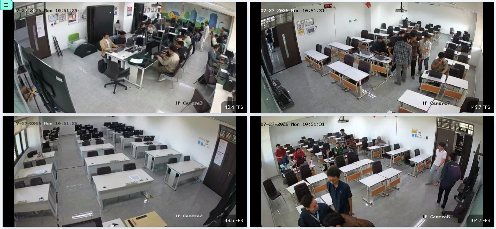

**Home Page (GIF)**

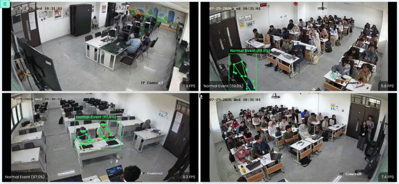

**Login Page**

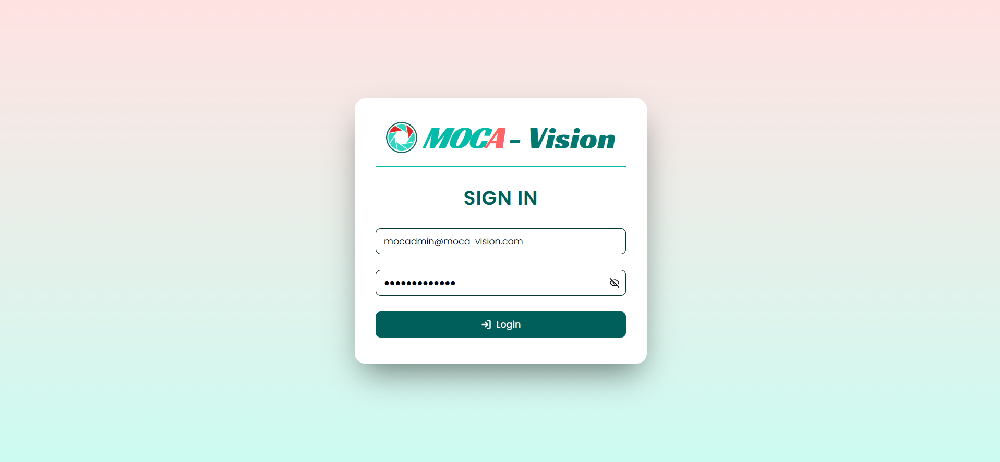

**Layout Page**

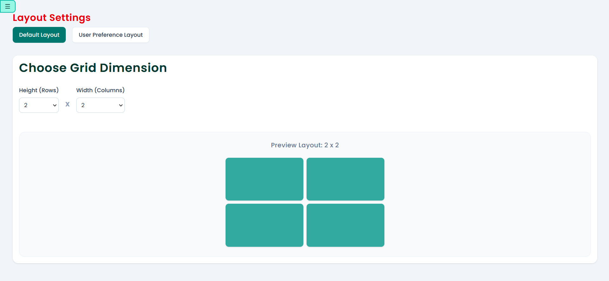

**Edge Device List Page**

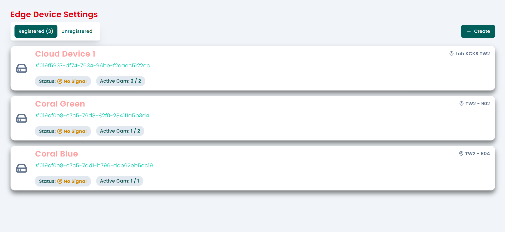

**Edge Device Detail Page**

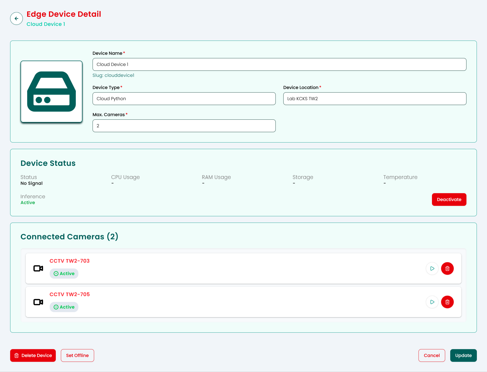

**Edge Device Create Page**

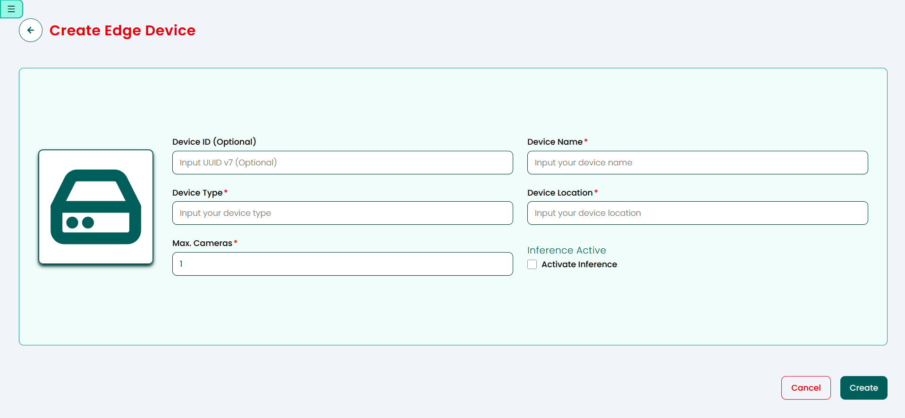

**CCTV / Camera List Page**

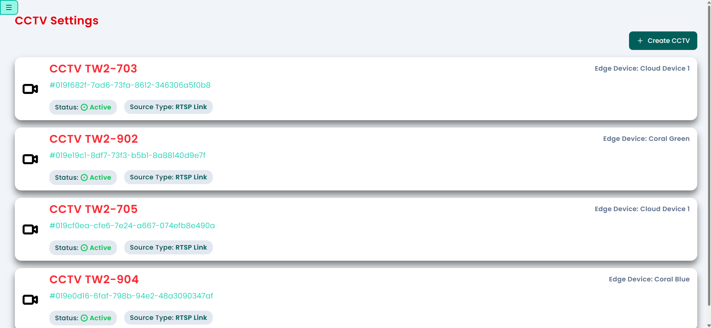

**CCTV / Camera Detail Page**

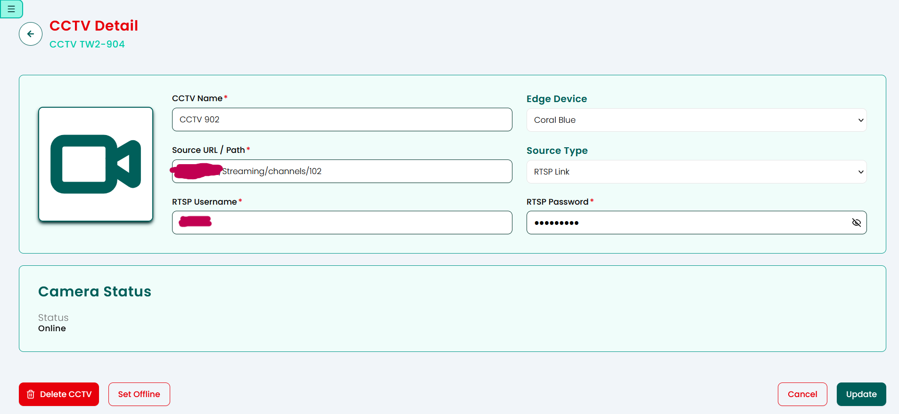

**CCTV / Camera Create Page**

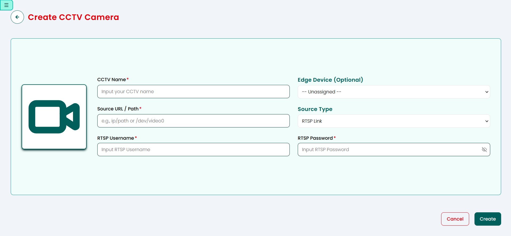

**Footage List Page**

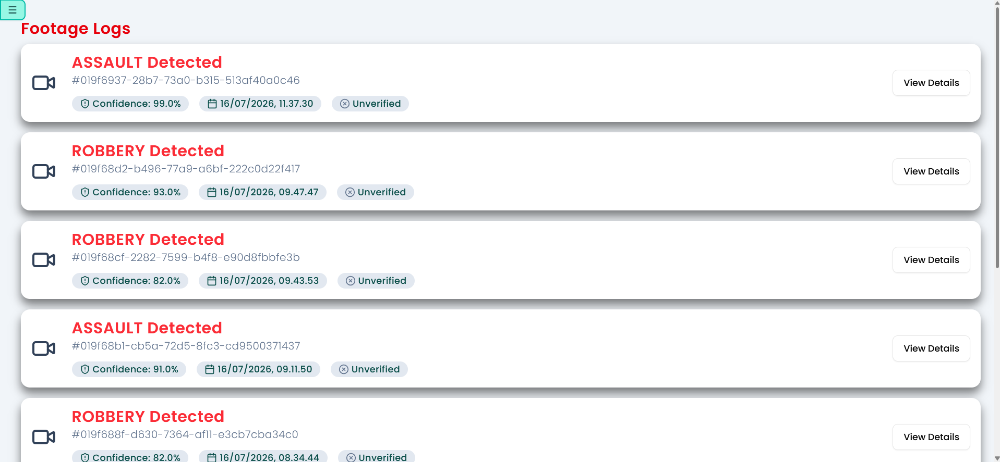

**Footage Detail Page**

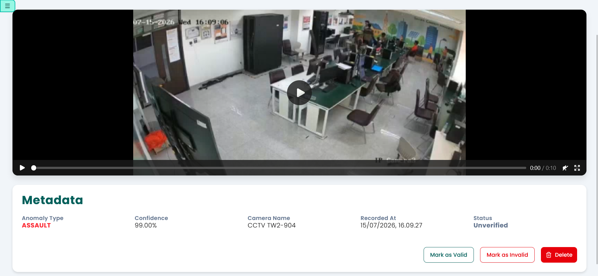

**WA Receiver List Page (Censored)**

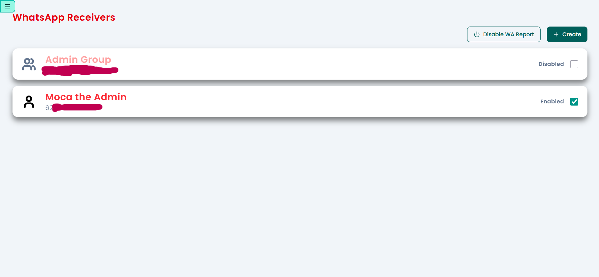

**WA Receiver Detail Page (Censored)**

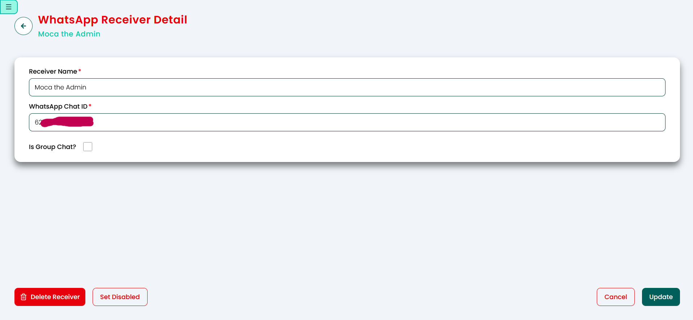

**WA Receiver Create Page**

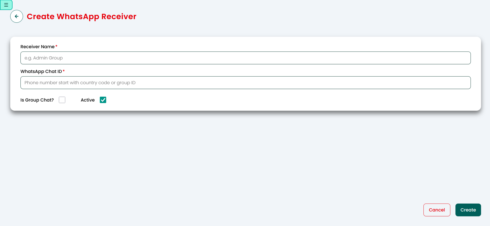

**Email Receiver List Page (Censored)**

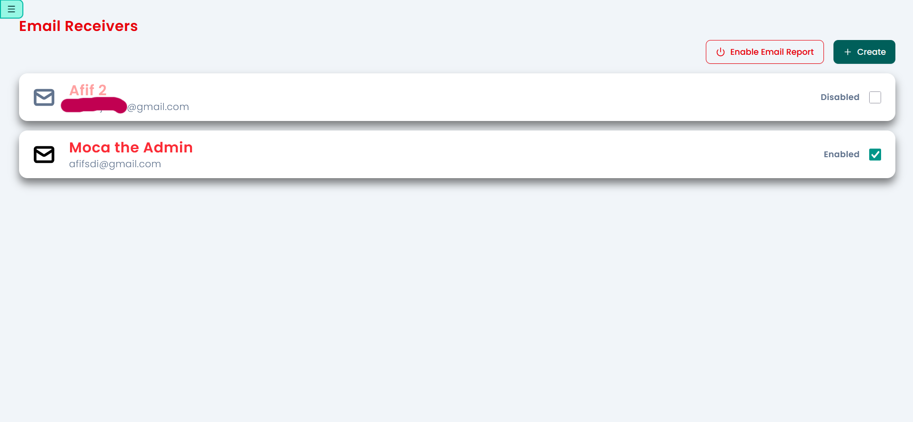

**Email Receiver Detail Page (Censored)**

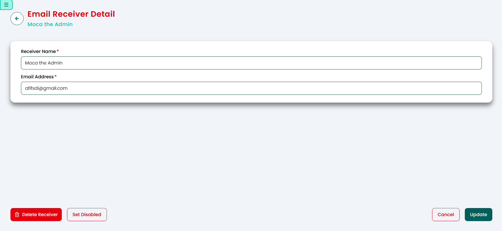

**Email Receiver Create Page**

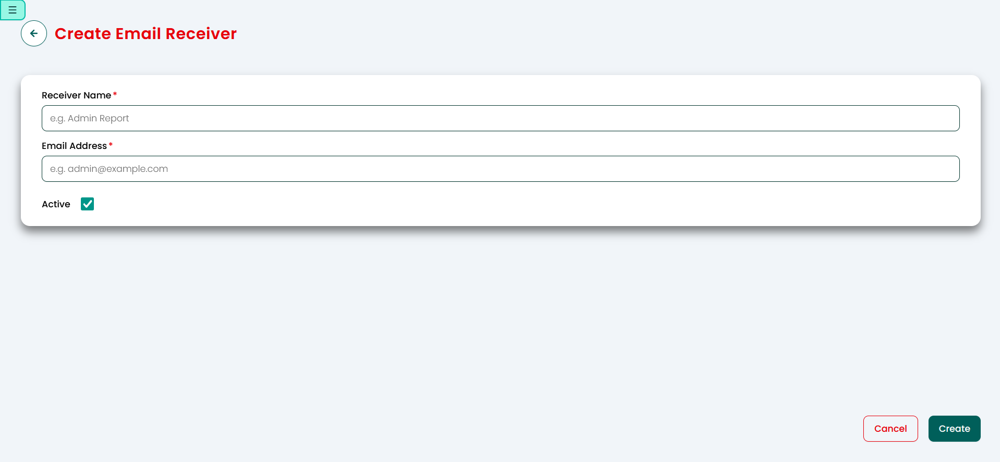

# Credit and Acknowledgement

- Dataset used in this research:

  1. **UCF-Crime Dataset** [(Sultani, Chen, & Shah, 2019)](https://www.crcv.ucf.edu/projects/real-world/)
  2. **Violence Dataset** [(Bianculli, *et al*., 2020)](https://doi.org/10.1016/j.dib.2020.106587)
  3. **Real-Life Violence Situation Dataset (RLVS)** [(Soliman, *et al*., 2019)](https://doi.org/10.1109/ICICIS46948.2019.9014714)

- Icon used: [Camera icons created by Freepik - Flaticon](https://www.flaticon.com/free-icons/camera)